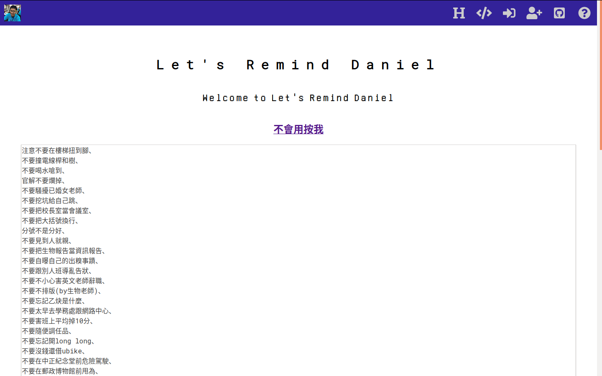

# daniel
大家幫忙提醒王品庠

註冊帳號之後可以幫忙一起提醒王品庠

---

# NOTICE
登入時如果密碼錯誤會回到登入頁面，錯誤訊息我還沒做

# .env
```
# DB
DB_PATH=./db/data.db
DB_SECRET=YOU_SHOULD_CHANGE_THIS

# bcrypt
BCRYPT_SALT_ROUNDS=10
```

# admin
新增 `db/admin.json`
內容是一個陣列
每個元素是管理員的 id （字串）
登入後進入 `/admin`

# TODO
1. 驗證電子信箱
2. 管理員功能 (完成部份)
3. 大眾審核
4. 訂閱
5. 整理 app.js

# Contribute
歡迎一起來改善這個系統 <3

# Licence
[MIT](./LICENCE)
